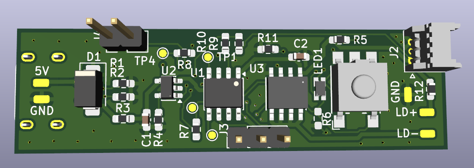
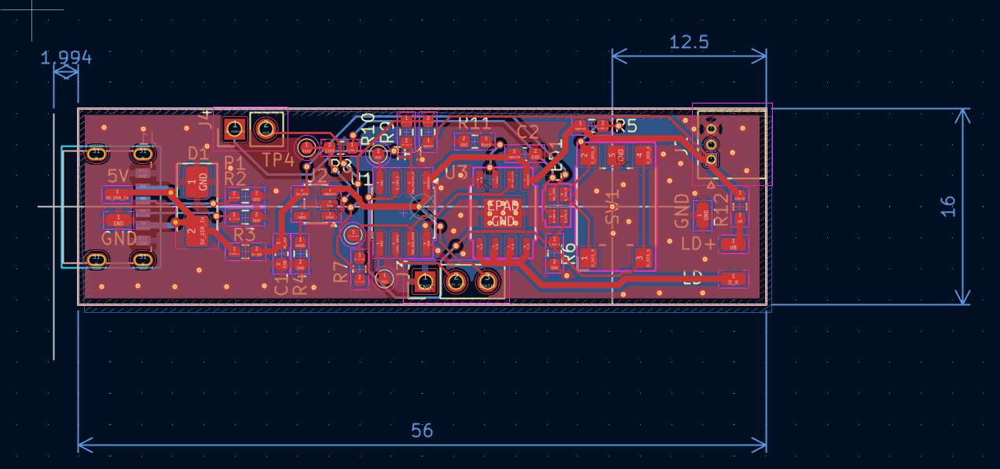
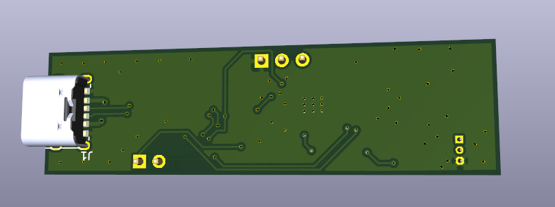
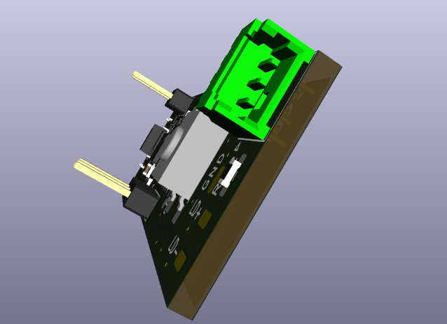

PCB (KiCad files + libraries) of a Cygolite bike light (white LED). Constant current driver [MIC4802YME](https://www.digikey.jp/ja/products/detail/microchip-technology/MIC4802YME/2621444) set at 750mA with Li-Ion battery connector and [MCP73831](https://www.digikey.jp/en/products/detail/microchip-technology/MCP73831T-2ACI-OT/964301) Li-Ion charger. ATTiny202 used for PWM output, status LED control and button sensing. USB-C 6P (power only) connector for charging. UART and UDPI pin headers. 

Using 0603 resistor and capacitors for best solderability + size combo.

Demonstration of circuits for multiplexing PWM<>Analog Input and Button Sense <> LED driver.

## Schematic and Images
See the [Schematic](Schematic.pdf) in `/Schematic.pdf`

PCB - top

PCB - 3D top

PCB - 3D back (shows USB)

Close up of battery connector

## TODOs
- [ ] add schematic pdfs and board image
- [ ] add multiplexing superposition explanation / blog post
- [ ] add BOM as spreadsheet
