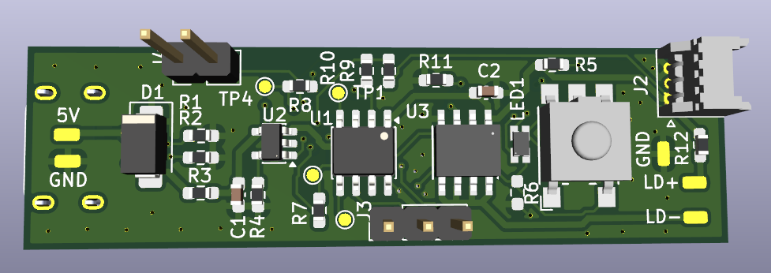
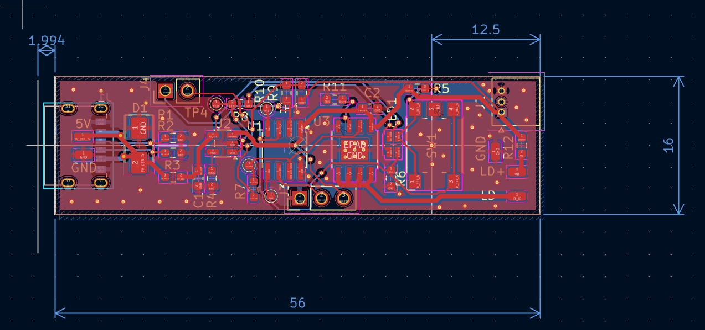
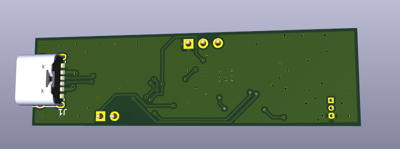
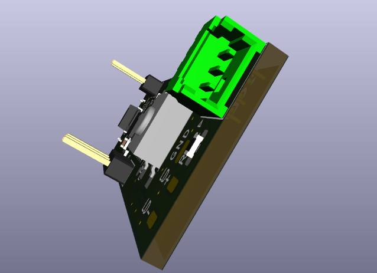

PCB (KiCad files + libraries) of a Cygolite bike light (white LED). Constant current driver [MIC4802YME](https://www.digikey.jp/ja/products/detail/microchip-technology/MIC4802YME/2621444) set at 750mA with Li-Ion battery connector and [MCP73831](https://www.digikey.jp/en/products/detail/microchip-technology/MCP73831T-2ACI-OT/964301) Li-Ion charger. ATTiny202 used for PWM output, status LED control and button sensing. USB-C 6P (power only) connector for charging. UART and UDPI pin headers. 

Using 0603 resistor and capacitors for best solderability + size combo.

Demonstration of circuits for multiplexing PWM<>Analog Input and Button Sense <> LED driver.

TODO add photo of the light itself

## Schematic and Images
See the [Schematic](Schematic.pdf) in `/Schematic.pdf`

PCB - top

PCB - 3D top

PCB - 3D back (shows USB)

Close up of battery connector

## BOM

See [BOM.csv][BOM.csv]

| Reference | Qty | Value             | MPN               | Manufacturer                        | Description                                                                                                |
|-----------|-----|-------------------|-------------------|-------------------------------------|------------------------------------------------------------------------------------------------------------|
| C1,C2     | 2   | 4.7u              | (Generic)         | (Generic)                           | Unpolarized capacitor                                                                                      |
| D1        | 1   | SMAJ5.0CA         | SMAJ5.0CA         | Littelfuse                          | TVS DIODE 5VWM 9.2VC DO214AC                                                                               |
| J1        | 1   | USB4125-GF-A-0190 | USB4125-GF-A-0190 | GCT                                 | USB Power-Only 6P Type-C Receptacle connector                                                              |
| J2        | 1   | 530480310         | 530480310         | Molex                               | CONN HEADER R/A 3POS 1.25MM                                                                                |
| J3        | 1   | Conn_01x03_Socket | N/A               | (Generic)                           | Generic connector, single row, 01x03, script generated                                                     |
| J4        | 1   | Conn_01x02_Socket | N/A               | (Generic)                           | Generic connector, single row, 01x02, script generated                                                     |
| LED1      | 1   | APHBM2012SURKCGKC | APHBM2012SURKCGKC | Kingbright                          | LED GREEN/RED CLEAR 2012(mm) SMD                                                                           |
| R1,R2     | 2   | 5.1K              | (Generic)         | (Generic)                           | Resistor 0603 5.1K                                                                                         |
| R3,R12    | 2   | 0                 | (Generic)         | (Generic)                           | Resistor 0603 0Ohm                                                                                         |
| R4,R5,R8  | 3   | 2K                | (Generic)         | (Generic)                           | Resistor 0603 2KOhm                                                                                        |
| R6        | 1   | 1M                | (Generic)         | (Generic)                           | Resistor                                                                                                   |
| R7,R9,R10 | 3   | 10K               | (Generic)         | (Generic)                           | Resistor 0603 10KOhm                                                                                       |
| R11       | 1   | 6.8K              | (Generic)         | (Generic)                           | Resistor 0603 6.8K 1%                                                                                      |
| SW1       | 1   | SW_Push           | FSM1LPTR          | TE Connectivity ALCOSWITCH Switches | Generic push-button switch, two contact pins and shield pin(s)                                             |
| U1        | 1   | ATtiny202-SS      | ATTINY202-SSN-ND  | Microchip Technology                | 20MHz, 2kB Flash, 128B SRAM, 64B EEPROM, SOIC-8                                                            |
| U2        | 1   | MCP73831-2-OT     | MCP73831T-2ACI/OT | Microchip Technology                | Single cell, Li-Ion/Li-Po charge management controller, 4.20V, Tri-State Status Output, in SOT23-5 package |
| U3        | 1   | MIC4802YME        | MIC4802YME        | Microchip Technology                | LED Driver IC 1 Output Linear PWM Dimming 800mA 8-SOIC-EP                                                  |

## TODOs
- [ ] add schematic pdfs and board image
- [ ] add multiplexing superposition explanation 